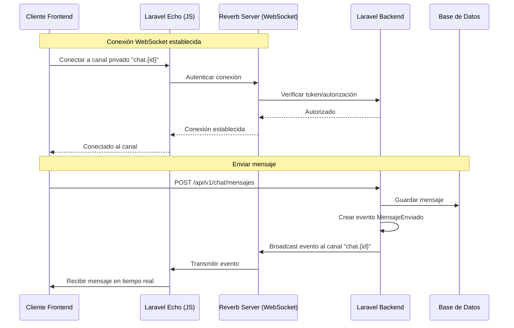

# Implementación de WebSockets con Laravel Reverb

## ¿Qué son los WebSockets?

Los WebSockets permiten comunicación **bidireccional en tiempo real** entre el servidor y el cliente. A diferencia de HTTP (request/response), los WebSockets mantienen una conexión abierta que permite:

- El servidor enviar datos al cliente sin que el cliente lo solicite
- El cliente recibir actualizaciones instantáneas
- Comunicación en tiempo real sin necesidad de polling constante

## Arquitectura del Sistema



## Flujo de Implementación

### 1. Backend - Instalación y Configuración

#### Paso 1: Instalar Laravel Reverb
```bash
composer require laravel/reverb
php artisan reverb:install
```

#### Paso 2: Configurar Variables de Entorno
```env
# .env
BROADCAST_DRIVER=reverb

REVERB_APP_ID=tu-app-id
REVERB_APP_KEY=tu-app-key
REVERB_APP_SECRET=tu-app-secret
REVERB_HOST=localhost
REVERB_PORT=8080
REVERB_SCHEME=http

# Para producción con SSL
REVERB_SCHEME=https
REVERB_PORT=443
```

#### Paso 3: Crear Evento Broadcast
```php
// app/Events/MensajeEnviado.php
namespace App\Events;

use Illuminate\Broadcasting\Channel;
use Illuminate\Broadcasting\InteractsWithSockets;
use Illuminate\Broadcasting\PresenceChannel;
use Illuminate\Broadcasting\PrivateChannel;
use Illuminate\Contracts\Broadcasting\ShouldBroadcast;
use Illuminate\Foundation\Events\Dispatchable;
use Illuminate\Queue\SerializesModels;

class MensajeEnviado implements ShouldBroadcast
{
    use Dispatchable, InteractsWithSockets, SerializesModels;

    public $mensaje;

    public function __construct($mensaje)
    {
        $this->mensaje = $mensaje;
    }

    /**
     * Canal privado donde se transmitirá el evento
     */
    public function broadcastOn(): Channel
    {
        // Canal privado: solo usuarios autorizados pueden escuchar
        return new PrivateChannel('chat.' . $this->mensaje->chat_id);
    }

    /**
     * Nombre del evento (opcional, por defecto usa el nombre de la clase)
     */
    public function broadcastAs(): string
    {
        return 'mensaje.enviado';
    }

    /**
     * Datos que se transmitirán al cliente
     */
    public function broadcastWith(): array
    {
        return [
            'id' => $this->mensaje->id,
            'chat_id' => $this->mensaje->chat_id,
            'emisor_tipo' => $this->mensaje->emisor_tipo,
            'mensaje' => $this->mensaje->mensaje,
            'enviado_en' => $this->mensaje->enviado_en->toIso8601String(),
            'leido' => $this->mensaje->leido,
        ];
    }
}
```

#### Paso 4: Configurar Autorización de Canales
```php
// routes/channels.php
use Illuminate\Support\Facades\Broadcast;

Broadcast::channel('chat.{chatId}', function ($user, $chatId) {
    // Verificar que el usuario tiene acceso a este chat
    if ($user->esCoach()) {
        $chat = \App\Models\Chat::where('id', $chatId)
            ->where('coach_id', $user->coach->id)
            ->exists();
        return $chat;
    }
    
    if ($user->esCliente()) {
        $chat = \App\Models\Chat::where('id', $chatId)
            ->where('cliente_id', $user->cliente->id)
            ->exists();
        return $chat;
    }
    
    return false;
});
```

#### Paso 5: Disparar Evento al Crear Mensaje
```php
// app/Http/Controllers/Coach/ControladorChat.php
use App\Events\MensajeEnviado;

public function enviarMensaje(Request $request, int $id): JsonResponse
{
    // ... validación y creación del mensaje ...
    
    $mensaje = Mensaje::create([...]);
    
    // Disparar evento broadcast
    broadcast(new MensajeEnviado($mensaje))->toOthers();
    
    return response()->json([...]);
}
```

### 2. Frontend - Configuración

#### Paso 1: Instalar Dependencias
```bash
npm install laravel-echo pusher-js
```

#### Paso 2: Configurar Laravel Echo
```javascript
// frontend/src/composables/useWebSocket.js
import Echo from 'laravel-echo'
import Pusher from 'pusher-js'

// Configurar Pusher para usar con Reverb
window.Pusher = Pusher

const echo = new Echo({
  broadcaster: 'reverb',
  key: import.meta.env.VITE_REVERB_APP_KEY,
  wsHost: import.meta.env.VITE_REVERB_HOST,
  wsPort: import.meta.env.VITE_REVERB_PORT,
  wssPort: import.meta.env.VITE_REVERB_PORT,
  forceTLS: (import.meta.env.VITE_REVERB_SCHEME ?? 'https') === 'https',
  enabledTransports: ['ws', 'wss'],
  // Autenticación para canales privados
  authEndpoint: `${import.meta.env.VITE_API_URL}/broadcasting/auth`,
  auth: {
    headers: {
      Authorization: `Bearer ${token}`,
      Accept: 'application/json',
    },
  },
})

export default echo
```

#### Paso 3: Escuchar Eventos en el Frontend
```javascript
// frontend/src/composables/useChat.js
import { ref, onMounted, onUnmounted } from 'vue'
import { useAuthStore } from '@/stores/auth'
import { useApi } from '@/composables/useApi'
import echo from '@/composables/useWebSocket'

export function useChat(chatId) {
  const mensajes = ref([])
  const { post } = useApi()
  const authStore = useAuthStore()

  // Suscribirse al canal privado del chat
  const canal = echo.private(`chat.${chatId}`)

  // Escuchar evento cuando se envía un mensaje
  canal.listen('.mensaje.enviado', (data) => {
    // Agregar mensaje a la lista
    mensajes.value.unshift(data)
  })

  // Enviar mensaje
  async function enviarMensaje(texto) {
    const respuesta = await post(`/chat/${chatId}/mensajes`, {
      mensaje: texto
    })
    
    // El mensaje se agregará automáticamente cuando llegue el evento broadcast
    return respuesta
  }

  // Limpiar suscripción al desmontar
  onUnmounted(() => {
    echo.leave(`chat.${chatId}`)
  })

  return {
    mensajes,
    enviarMensaje
  }
}
```

## Diferencias Clave: HTTP vs WebSockets

### HTTP (Request/Response)
```
Cliente → Servidor: "¿Hay mensajes nuevos?"
Servidor → Cliente: "Sí, aquí están"
[Espera...]
Cliente → Servidor: "¿Hay mensajes nuevos?"
Servidor → Cliente: "No"
[Espera...]
Cliente → Servidor: "¿Hay mensajes nuevos?"
Servidor → Cliente: "Sí, aquí están"
```
**Problema**: El cliente debe preguntar constantemente (polling)

### WebSockets (Conexión Persistente)
```
Cliente ←→ Servidor: [Conexión establecida]
Servidor → Cliente: "Tienes un mensaje nuevo" [instantáneo]
Servidor → Cliente: "Tienes otro mensaje" [instantáneo]
```
**Ventaja**: El servidor notifica inmediatamente cuando hay cambios

## Canales en Laravel

### Canal Público
```php
// Cualquiera puede escuchar
return new Channel('publico');
```

### Canal Privado
```php
// Requiere autenticación y autorización
return new PrivateChannel('chat.{chatId}');
// Se verifica en routes/channels.php
```

### Canal de Presencia
```php
// Para saber quién está conectado
return new PresenceChannel('chat.{chatId}');
```

## Ejecutar Reverb en Producción

### Desarrollo
```bash
php artisan reverb:start
```

### Producción (con Supervisor)
```ini
# /etc/supervisor/conf.d/reverb.conf
[program:reverb]
command=php /ruta/a/tu/proyecto/artisan reverb:start
autostart=true
autorestart=true
user=www-data
redirect_stderr=true
stdout_logfile=/ruta/a/logs/reverb.log
```

## Troubleshooting

### Problema: No se conecta
- Verificar que Reverb esté corriendo: `php artisan reverb:start`
- Verificar puerto y firewall
- Verificar variables de entorno

### Problema: No recibe eventos
- Verificar autorización en `routes/channels.php`
- Verificar que el evento implementa `ShouldBroadcast`
- Verificar que se llama `broadcast()` después de crear el mensaje

### Problema: Error de autenticación
- Verificar token en headers de Echo
- Verificar que el endpoint `/broadcasting/auth` esté configurado
- Verificar middleware de autenticación

## Ventajas de Reverb

1. **Nativo de Laravel**: No necesitas servicios externos como Pusher
2. **Gratis**: Auto-hospedado, sin costos adicionales
3. **Escalable**: Puedes usar Redis para múltiples servidores
4. **Fácil de usar**: API similar a otros componentes de Laravel
5. **Seguro**: Soporte para canales privados y autenticación

## Alternativas

- **Pusher**: Servicio externo (pago después de cierto límite)
- **Socket.io**: Más complejo, requiere Node.js
- **Ably**: Similar a Pusher, servicio externo

Reverb es la mejor opción para Laravel porque está integrado y es gratuito.

